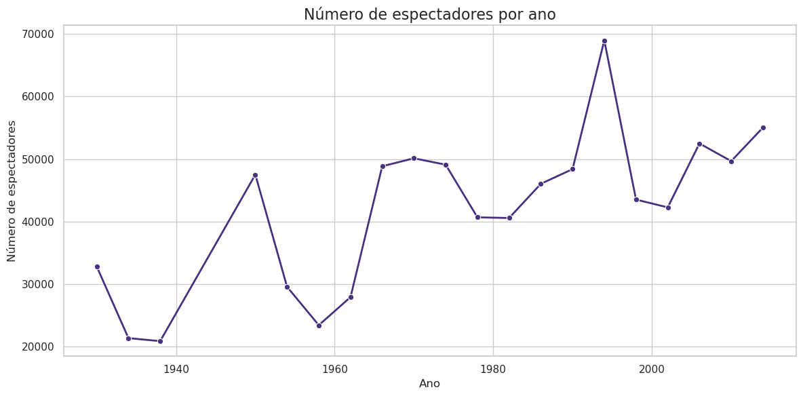
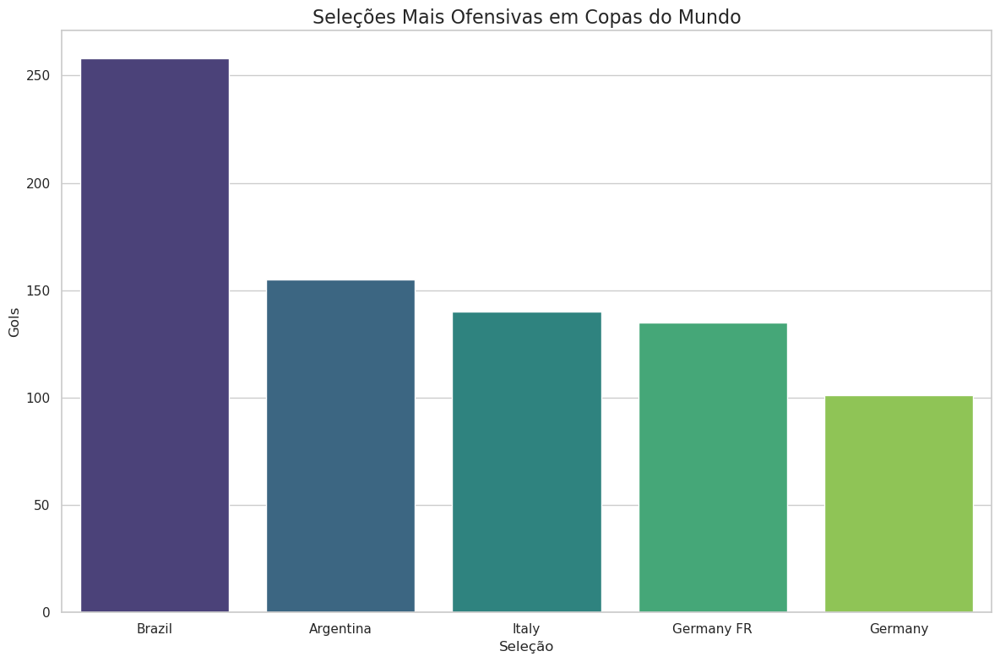

# Análise Histórica das Copas do Mundo (1930–2014)

Projeto de análise exploratória (EDA) de dados históricos da Copa do Mundo da FIFA.  
**Fonte dos dados**: [Kaggle](https://www.kaggle.com/datasets/abecklas/fifa-world-cup/data).

## 🎯 Objetivo
- Verificar a evolução do público nos estádios.
- Identificar tendências no número de cartões amarelos e vermelhos.
- Explorar dados sobre jogadores e times.
- Analisar o número de gols marcados ao longo das Copas do Mundo.
- Analisar a ofensividade das seleções

## 🔍 Principais Insights
- **Top 5 Artilheiros Históricos**: James Rofríguez(Colômbia) lidera com 14 gols (*outlier - consulte o site oficial da FIFA*).  
- **Comportamento do Público**: Auge nos anos 1990.  
- **Cartões Vermelhos**: Queda acentuada pós-2006.  
- **Equipes Ofensivas**: Brasil, Argentina, Itália e Alemanha dominam em gols fora de casa.  

## 🛠️ Tecnologias
- **Linguagem**: Python  
- **Bibliotecas**: Pandas, Matplotlib, Seaborn  
- **Ferramentas**: Jupyter Notebook  
- **Sistema Operacional**: Linux EndeavourOS

## 📊 Visualizações Destacadas
| Variação de Público (1930–2014) | Cartões Amarelos vs. Vermelhos |
|---------------------------------|--------------------------------|
|  |  |

## 📜 Licença MIT  
Este projeto está licenciado sob a **Licença MIT** - veja o arquivo [LICENSE](LICENSE) para detalhes.

